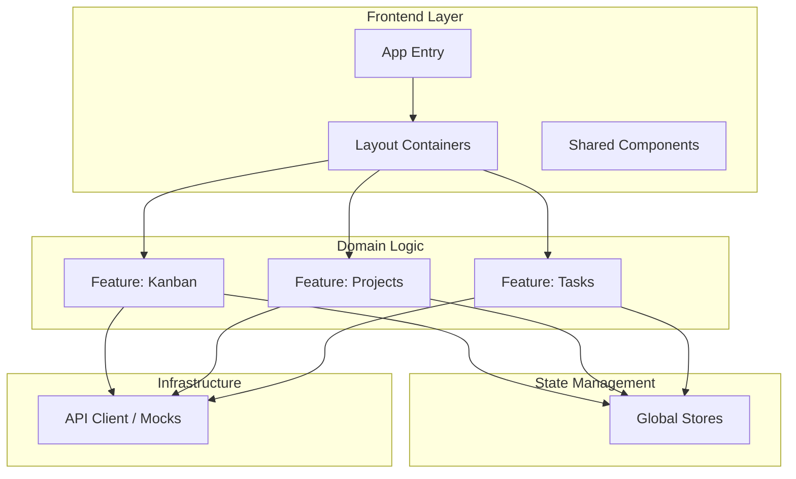

# TaskFlow: Professional Agile Project Management Framework

---

## 1. Executive Summary
TaskFlow is a high-performance, modular project management framework engineered for modern agile development teams. By combining a real-time Kanban visualization engine with deep sprint planning capabilities and advanced task lifecycle management, TaskFlow transforms complex development workflows into a cohesive, intuitive, and data-driven digital experience. It bridges the gap between high-level strategy and granular task execution.


---

## 2. Project Philosophy & Core Values
TaskFlow is built on the belief that project management tools should accelerate, not impede, developer velocity. Our framework prioritizes:

*   **Type-Safety:** Full-stack TypeScript integration from UI components to data models ensures compile-time safety and reduces runtime errors.
*   **Modular Scalability:** A domain-driven architecture that allows features to be added without impacting system stability.
*   **Developer Experience (DX):** Streamlined tooling, hot-module replacement, and strict linting to keep code clean and maintainable.
*   **Performance:** Sub-second interaction latency powered by modern bundling and efficient state management.
*   **Accessibility:** Built with industry-standard accessibility patterns, ensuring the tool is usable by all developers.

---

## 3. Technology Stack & Tooling
TaskFlow utilizes a robust, industry-standard stack selected for long-term maintainability, developer velocity, and runtime performance.

*   **Runtime:** Node.js (v20+)
*   **Language:** TypeScript (Strict Mode Enabled)
*   **Frontend Framework:** React 18+ (Functional Components/Hooks)
*   **Build System:** Vite 6
*   **Routing:** TanStack Router (Type-Safe, Data-First Routing)
*   **State Management:** Custom Zod-validated stores (centralized & performant)
*   **UI Primitives:** Shadcn UI + Radix UI (Accessible interaction patterns)
*   **Styling:** Tailwind CSS (Utility-first)
*   **Package Manager:** Bun 1.1+ (High-speed resolution)
*   **Schema Validation:** Zod (Type-safe runtime validation)

---

## 4. Architecture & Design
TaskFlow employs a **Feature-Oriented Domain Architecture**. Business logic is encapsulated within self-contained features, reducing cognitive load and preventing monolithic "God Object" anti-patterns.

### Component Hierarchy


### Directory Structure
```text
/src
├── /app             # Core app bootstrap, layouts, providers, stores
├── /components      # Reusable UI primitives (Shadcn)
├── /features        # Domain-driven features (kanban, auth, tasks, etc.)
├── /hooks           # Global hooks and shared utility hooks
├── /lib             # Core configurations (api clients, error reporting)
├── /routes          # TanStack Router route definitions
└── /shared          # Cross-domain business logic and constants
```

---

## 5. Getting Started

### 5.1. Prerequisites
Before cloning, ensure you have the required environment:
| Tool | Requirement |
| :--- | :--- |
| Node.js | v20.0.0 or higher |
| Bun | v1.1.0 or higher |
| Git | v2.30.0 or higher |

### 5.2. Setup Pipeline
```bash
# Clone the repository
git clone https://github.com/your-org/TaskFlow.git
cd TaskFlow/Frontend

# Install dependencies via Bun
bun install

# Run the development environment
bun dev
```

---

## 6. Configuration & Environment Variables
TaskFlow manages configuration via environment-specific `.env` files. Ensure you copy the `.env.example` file before starting development.

| Environment Variable | Description | Default |
| :--- | :--- | :--- |
| `VITE_API_URL` | Base endpoint for backend services | `http://localhost:3000` |
| `VITE_APP_MODE` | Runtime environment profile | `development` |
| `VITE_ENABLE_MOCKS` | Enables internal API mocking for testing | `true` |
| `VITE_LOG_LEVEL` | Determines verbosity of client-side logs | `debug` |

> **Security Warning:** Never check `.env` files containing production secrets into source control. Utilize `.env.local` for machine-specific local overrides.

---

## 7. Testing & Quality Assurance
We maintain a "Zero Tolerance" policy for regression. Every feature requires unit tests, and every PR must pass the CI gate.

### Test Suites
* **Unit/Integration:** `bun test` - Utilizes Vitest to execute tests in an isolated, high-speed environment.
* **Type Safety:** `tsc --noEmit` - Validates the integrity of the TypeScript definition graph.
* **Linting:** `bun run lint` - Enforces architectural and stylistic consistency.
* **Formatting:** `bun run format` - Automatically applies Prettier standards.

---

## 8. Development Workflow
1. **Feature Branching:** Use descriptive branch names: `feat/`, `fix/`, or `refactor/` followed by the issue ID.
2. **Review:** All PRs require at least one maintainer approval. Ensure the PR title matches the conventional commit format.
3. **Deployment:** CI pipeline automatically builds and deploys to the staging environment upon successful merge to `main`.

---

## 9. Troubleshooting
* **Dependency Issues:** Run `bun install --force` if you encounter unexpected module resolution errors.
* **Cache:** Clear the `.vite/` folder if you encounter stale HMR issues.
* **API Mocking:** Check `src/shared/api/mock-client.ts` if you need to modify or disable existing mock responses.

---

## 10. Contribution Guidelines
We strictly follow standard agile development patterns:
* **Code of Conduct:** Please review our [Code of Conduct](CODE_OF_CONDUCT.md).
* **PR Template:** Use the built-in PR template to describe changes.
* **Feedback:** We use GitHub Issues to track bugs and feature requests.

---

## 11. License
This project is proprietary and governed by the **MIT License**.
See the [LICENSE](LICENSE) file for comprehensive legal details.

---

*TaskFlow Framework | Engineered for Efficiency*
*Last Updated: 2026-06-01*
