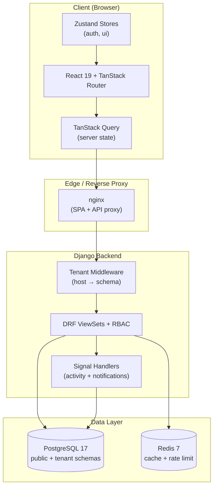

# TaskFlow: Enterprise Work Management Platform

TaskFlow is a production-grade, multi-tenant work management SaaS platform. It lets organizations create projects, manage tasks on Kanban boards, plan sprints, assign team members with granular role-based access control, and receive real-time notifications — all with strict per-tenant data isolation powered by PostgreSQL schema-based multi-tenancy.

---

## ✨ Features

- **Multi-Tenant Architecture** — Each organization gets an isolated PostgreSQL schema. Shared data (users, auth tokens) lives in the `public` schema; tenant data (projects, tasks, sprints) is fully isolated per tenant.
- **Granular RBAC** — Four roles (`admin`, `manager`, `member`, `viewer`) enforced through custom DRF permission classes (`IsTenantMember`, `IsTenantAdmin`, `IsTenantManager`, `IsTenantWriteMember`).
- **Kanban & Sprint Planning** — Drag-and-drop task management, sprint start/complete workflows with automatic backlog migration of incomplete tasks.
- **Atomic Task Keys** — Race-free task key generation (`TF-1`, `TF-2`) using database-level atomic counter increments (`F('task_counter')`).
- **Real-Time Notifications** — Automatic notification creation via Django signals when tasks are created, comments are added, or sprint status changes.
- **Full-Text Search** — PostgreSQL-powered weighted search across task titles and descriptions.
- **Security Hardening** — Rate-limited JWT auth endpoints, HSTS, CSP, X-Frame-Options, request logging middleware with timing headers.
- **Caching** — Redis-backed caching for expensive computed properties (sprint point aggregation, project progress).
- **API Documentation** — Auto-generated OpenAPI/Swagger docs via DRF Spectacular.
- **Error Tracking** — Optional Sentry integration (DSN-based).

---

## 🛠 Technology Stack

| Layer | Technology |
|-------|-----------|
| **Frontend** | React 19, TypeScript 5.8, TanStack Router & Query, Zustand, Tailwind CSS v4, Shadcn UI, Vite 7 |
| **Backend** | Django 6.0, Django REST Framework 3.17, django-tenants 3.10, SimpleJWT 5.5 |
| **Database** | PostgreSQL 17 (schema-per-tenant isolation) |
| **Cache** | Redis 7 (caching, rate limiting, session store) |
| **API Docs** | DRF Spectacular (OpenAPI 3 / Swagger UI) |
| **Infrastructure** | Docker, Docker Compose, nginx, GitHub Actions, Woodpecker CI |

---

## 🏗 Architecture Overview



**Request lifecycle:**
1. Browser makes an authenticated request to `https://{tenant}.host/api/tasks/`
2. nginx proxies `/api/` to the Django backend
3. `TenantMainMiddleware` resolves the tenant from the `Host` header and sets the PostgreSQL search path
4. `RequestLoggingMiddleware` records the request with timing
5. DRF authenticates the JWT, then the RBAC permission class verifies the user's role
6. The ViewSet executes, signals fire for side effects (activity logging, notifications)
7. Redis is consulted for cached values; PostgreSQL serves tenant-scoped data

> **Full architecture deep-dive:** See [`docs/architecture.md`](docs/architecture.md)

---

## 📁 Project Structure

```
TaskFlow/
├── Backend/                       # Django REST API
│   ├── core/                      # Member, Project, RBAC permissions
│   ├── tasks/                     # Task, Comment, ActivityItem, Attachment
│   ├── sprints/                   # Sprint with cached point aggregation
│   ├── notifications/             # Notification model + auto-generation signals
│   ├── organizations/             # Tenant (Organization), Domain, onboarding
│   ├── health/                    # /health/ endpoint
│   ├── taskforge_backend/         # Project settings, URLs, middleware, auth
│   │   ├── settings.py            # Production settings (env-driven)
│   │   ├── middleware.py          # RequestLoggingMiddleware
│   │   ├── authentication.py      # EmailOrUsernameBackend
│   │   ├── rate_limits.py         # Rate-limited JWT views
│   │   ├── urls_public.py         # Public routes (health, auth, onboarding)
│   │   └── urls_tenant.py         # Tenant routes (router-registered APIs)
│   ├── tests/setup/               # TenantTestRunner + test_settings
│   ├── bootstrap_public.py        # Demo data seeder
│   ├── requirements.txt
│   └── manage.py
├── Frontend/                      # React SPA
│   ├── src/
│   │   ├── routes/                # File-based TanStack Router routes
│   │   │   ├── _auth/             # Login, register, password reset
│   │   │   └── _authenticated/    # Dashboard, projects, tasks, etc.
│   │   ├── features/              # Feature modules (pages by domain)
│   │   ├── lib/api/               # API client, hooks, mappers
│   │   ├── app/store/             # Zustand stores
│   │   ├── shared/                # Types, hooks, utils, components
│   │   └── components/ui/         # Shadcn UI primitives
│   ├── vitest.config.ts           # Unit/integration test config
│   ├── playwright.config.ts       # E2E test config
│   └── package.json
├── tests/                         # Root-level unified test suite
│   ├── frontend/                  # Component, hook, store, form tests
│   ├── backend/                   # Data access + mock client tests
│   ├── database/                  # CRUD, transactions, seed integrity
│   ├── integration/               # Auth flow + data rendering
│   ├── e2e/                       # Playwright specs
│   ├── fixtures/                  # Test data factories
│   └── mocks/                     # In-memory DB for database-tier tests
├── docs/                          # This documentation
├── docker-compose.yml             # Full-stack local environment
├── Makefile                       # Local CI runner (make ci)
├── .github/workflows/ci.yml       # GitHub Actions CI pipeline
└── .woodpecker.yml                # Free self-hosted CI alternative
```

---

## 🚀 Getting Started

### Prerequisites

- **Docker** & **Docker Compose** (recommended — runs everything)
- **Python 3.12+** (for local backend dev without Docker)
- **Node.js 22+** (for local frontend dev without Docker)
- **PostgreSQL 17** and **Redis 7** (or use Docker)

### Option A: Full Stack with Docker (Recommended)

```bash
git clone https://github.com/your-org/TaskFlow.git
cd TaskFlow
cp Backend/.env.example Backend/.env
cp Frontend/.env.example Frontend/.env
docker compose up -d --build
```

Then seed the demo tenant:

```bash
docker compose exec backend python bootstrap_public.py
```

Access the app:
- **Frontend:** http://localhost:8080
- **Backend API:** http://localhost:8000/api/
- **Swagger UI:** http://localhost:8000/api/docs/
- **Health check:** http://localhost:8000/health/

### Option B: Local Development (without Docker)

**1. Start infrastructure (PostgreSQL + Redis):**

```bash
docker compose up -d db redis
```

**2. Backend:**

```bash
cd Backend
python -m venv venv
source venv/bin/activate        # Windows: venv\Scripts\activate
pip install -r requirements.txt
python manage.py migrate
python manage.py runserver
```

**3. Frontend:**

```bash
cd Frontend
npm install
npm run dev
```

> **Note:** The backend uses port 8000 by default. If port 8000 is occupied, run on an alternate port (`python manage.py runserver 8001`) and update `VITE_API_URL` in `Frontend/.env`.

---

## ⚙️ Configuration

### Environment Variables

All configuration is environment-driven via `python-decouple`. Copy the `.env.example` files and fill in production values.

#### Backend (`Backend/.env`)

| Variable | Default | Description |
|----------|---------|-------------|
| `SECRET_KEY` | `django-insecure-...` | Django secret key. **Must override in production.** |
| `DEBUG` | `False` | Enable Django debug mode |
| `ALLOWED_HOSTS` | `.localhost,localhost,127.0.0.1` | Comma-separated allowed hosts |
| `DB_NAME` | `taskforge_db` | PostgreSQL database name |
| `DB_USER` | `postgres` | Database user |
| `DB_PASSWORD` | `password` | Database password |
| `DB_HOST` | `localhost` | Database host |
| `DB_PORT` | `5433` | Database port |
| `REDIS_URL` | `redis://localhost:6379/0` | Redis connection URL |
| `CORS_ALLOWED_ORIGINS` | `http://localhost:8080,...` | Allowed CORS origins (comma-separated) |
| `SENTRY_DSN` | *(empty)* | Sentry error tracking DSN (optional) |
| `ENVIRONMENT` | `development` | Deployment environment label |
| `MEDIA_ROOT` | `/app/media` | File upload storage path |

#### Frontend (`Frontend/.env`)

| Variable | Default | Description |
|----------|---------|-------------|
| `VITE_API_URL` | `http://localhost:8000` | Backend API base URL |

---

## 🧪 Running Tests

TaskFlow has a unified test suite covering frontend, backend, database, and end-to-end layers.

### Run Everything (Local CI)

```bash
make ci
```

### Backend Tests (Django)

```bash
# Using the tenant-aware test runner + test settings
cd Backend
python manage.py test --settings=tests.setup.test_settings --verbosity=2
```

### Frontend Tests (Vitest)

```bash
cd Frontend
npx vitest run --reporter=verbose
```

### Frontend with Coverage

```bash
cd Frontend
npx vitest run --coverage
```

### End-to-End Tests (Playwright)

```bash
cd Frontend
npx playwright test
```

> **Full testing guide:** See [`docs/testing.md`](docs/testing.md)

---

## 🏗 Build Instructions

### Frontend Production Build

```bash
cd Frontend
npm run build      # Outputs to Frontend/dist/
```

The production Docker image uses a multi-stage build (node builder → nginx server) defined in `Frontend/Dockerfile`.

### Backend

The backend runs via `python manage.py runserver` in development. For production, use a WSGI server (e.g., `gunicorn`) behind the included nginx configuration.

```bash
docker build -t taskflow-backend ./Backend
docker build -t taskflow-frontend ./Frontend
```

---

## 📡 API Overview

The API is JWT-authenticated and organized around REST resources. All tenant-scoped endpoints require a valid JWT in the `Authorization: Bearer <token>` header and are resolved to the correct tenant schema via the `Host` header.

| Endpoint | Method | Auth | Description |
|----------|--------|------|-------------|
| `/health/` | GET | None | Service health (DB + Redis status) |
| `/api/onboard/` | POST | None | Create a new organization + admin user |
| `/api/auth/token/` | POST | None | Obtain JWT (rate-limited 5/min) |
| `/api/auth/token/refresh/` | POST | None | Refresh JWT (rate-limited 30/min) |
| `/api/projects/` | GET/POST | Write member | List/create projects |
| `/api/tasks/` | GET/POST | Write member | List/create tasks |
| `/api/tasks/search/` | GET | Member | Full-text search |
| `/api/sprints/` | GET/POST | Write member | List/create sprints |
| `/api/sprints/{id}/start/` | POST | Write member | Start a sprint |
| `/api/sprints/{id}/complete/` | POST | Write member | Complete a sprint |
| `/api/notifications/` | GET/POST | Member | List/mark-read notifications |
| `/api/notifications/mark_all_read/` | POST | Member | Mark all notifications read |
| `/api/members/` | GET | Member | List tenant members |
| `/api/comments/` | GET/POST | Write member | List/create comments |
| `/api/activities/` | GET | Member | List activity items |
| `/api/attachments/` | GET/POST | Write member | List/create attachments |
| `/api/docs/` | GET | None | Swagger UI |
| `/api/schema/` | GET | None | OpenAPI schema |

> **Complete API reference:** See [`docs/api.md`](docs/api.md)

### Example: Authenticate

```bash
# Obtain a JWT token
curl -X POST http://localhost:8000/api/auth/token/ \
  -H "Content-Type: application/json" \
  -d '{"username": "alice@taskflow.com", "password": "password"}'

# Use the token (note the tenant Host header)
curl http://demo.localhost:8000/api/tasks/ \
  -H "Authorization: Bearer <access_token>"
```

### Example: Create a Task

```bash
curl -X POST http://demo.localhost:8000/api/tasks/ \
  -H "Authorization: Bearer <access_token>" \
  -H "Content-Type: application/json" \
  -d '{
    "title": "Implement OAuth",
    "projectId": 1,
    "reporterId": 1,
    "status": "todo",
    "priority": "high"
  }'
```

---

## 🚢 Deployment

### Docker Compose (Single Server)

```bash
cp Backend/.env.example Backend/.env   # Edit with production values
cp Frontend/.env.example Frontend/.env
docker compose up -d --build
docker compose exec backend python manage.py migrate
```

### Production Checklist

- [ ] Set a strong `SECRET_KEY` (e.g., `openssl rand -base64 64`)
- [ ] Set `DEBUG=False`
- [ ] Configure `ALLOWED_HOSTS` with your domain
- [ ] Set a strong database password
- [ ] Configure `CORS_ALLOWED_ORIGINS`
- [ ] Set up HTTPS via a reverse proxy
- [ ] (Optional) Configure `SENTRY_DSN`

> **Full deployment guide:** See [`docs/deployment.md`](docs/deployment.md)

---

## 🔧 Troubleshooting

### "relation does not exist" errors

This is the classic django-tenants failure. It means a tenant schema wasn't migrated. Fix:

```bash
docker compose exec backend python manage.py migrate_schemas --shared
```

### Port 8000 already in use

Run the backend on an alternate port and update the frontend env:

```bash
cd Backend && python manage.py runserver 8001
# Then in Frontend/.env: VITE_API_URL=http://localhost:8001
```

### Redis connection refused

Ensure Redis is running:

```bash
docker compose up -d redis
docker compose exec redis redis-cli ping   # Should return PONG
```

### Database connection issues

```bash
docker compose exec db psql -U postgres -d taskforge_db -c "SELECT 1"
```

### Login fails with "No member found"

The user exists in the `public` schema but has no `Member` row in the tenant schema. Run the bootstrap script or ensure onboarding created the member:

```bash
docker compose exec backend python bootstrap_public.py
```

---

## 🤝 Contributing

1. Create a feature branch: `git checkout -b feat/your-feature`
2. Make your changes following existing conventions
3. **Run tests before pushing:** `make ci`
4. Ensure linting passes: `make lint-backend lint-frontend`
5. Submit a pull request targeting `main` or `develop`

### Coding Conventions

- **Backend:** PEP 8, `black` formatting, `flake8` linting (max line length 127)
- **Frontend:** ESLint + Prettier, TypeScript strict mode, functional components with hooks
- **Tests:** Every new feature must include tests. No skipped or TODO tests in the suite.

> **Contributing guide:** See [`docs/developer-guide.md`](docs/developer-guide.md)

---

## 📄 License

This project is proprietary and governed by the **MIT License**.

---

## 📚 Documentation Index

| Document | Description |
|----------|-------------|
| [docs/architecture.md](docs/architecture.md) | System architecture, data flow, design patterns |
| [docs/database.md](docs/database.md) | Schema, relationships, constraints, ER diagram |
| [docs/api.md](docs/api.md) | Complete REST API reference |
| [docs/developer-guide.md](docs/developer-guide.md) | How to add features, endpoints, components |
| [docs/testing.md](docs/testing.md) | Testing strategy, frameworks, how to run |
| [docs/deployment.md](docs/deployment.md) | Build, deploy, scale, rollback |
