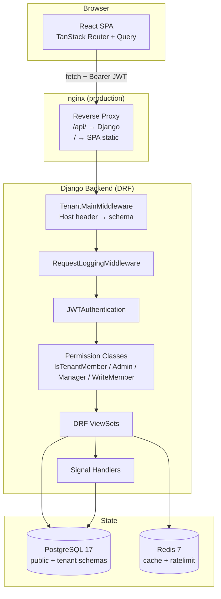
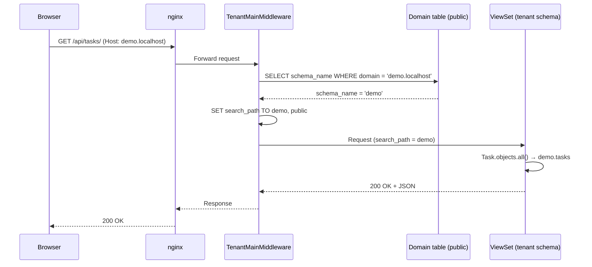
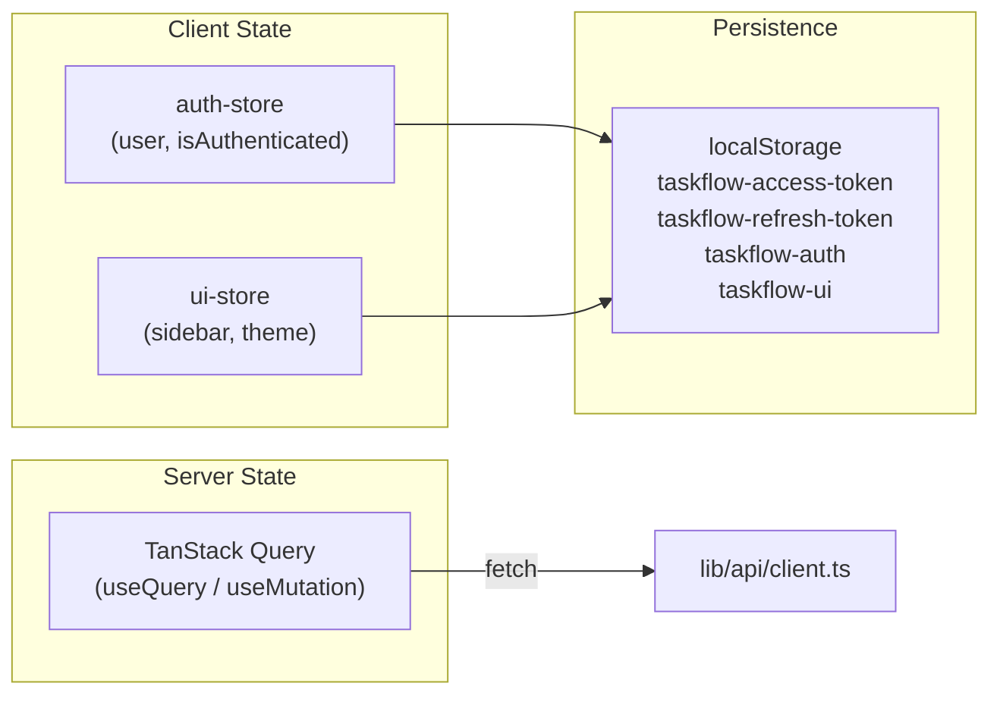
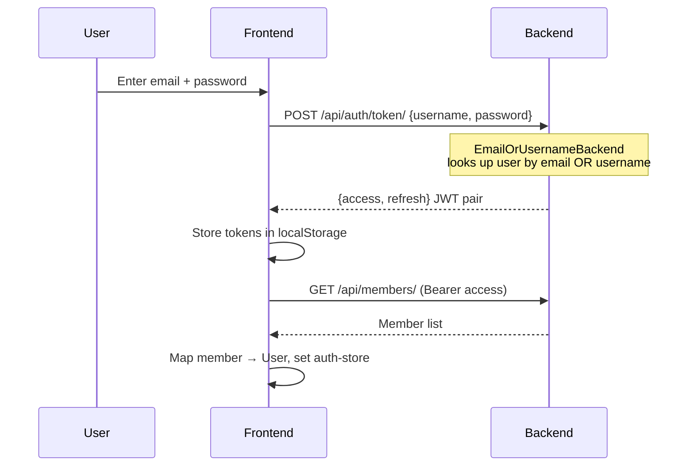
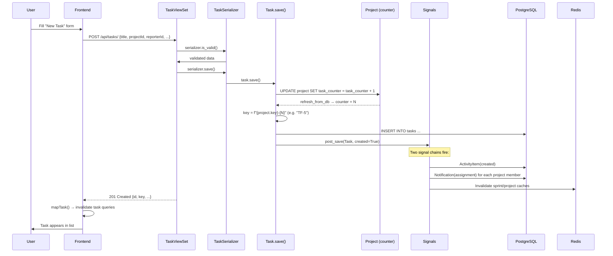

# Architecture

This document describes the system architecture of TaskFlow, including the multi-tenant model, request lifecycle, data flow, module responsibilities, and design patterns.

---

## 1. High-Level Architecture

TaskFlow is a monolithic full-stack application with a clear separation between a React single-page application (SPA) frontend and a Django REST Framework (DRF) backend. The defining architectural characteristic is **schema-based multi-tenancy**: every organization ("tenant") gets its own PostgreSQL schema, providing strong data isolation without the overhead of separate databases.



---

## 2. Multi-Tenant Model (django-tenants)

### How it works

TaskFlow uses the **schema-per-tenant** strategy provided by `django-tenants`:

- The `public` schema holds **shared** models: `Organization`, `Domain`, `User`, token blacklist tables.
- Each tenant (e.g., `demo`) gets a dedicated schema (e.g., `demo`) holding **tenant** models: `Member`, `Project`, `Task`, `Sprint`, `Notification`, `Comment`, `ActivityItem`, `Attachment`.

### Schema separation in settings

```python
# Backend/taskforge_backend/settings.py
SHARED_APPS = [
    'django_tenants', 'organizations', 'corsheaders', 'health',
    'django.contrib.contenttypes', 'django.contrib.auth',
    'django.contrib.sessions', 'django.contrib.messages',
    'django_ratelimit', 'django.contrib.staticfiles',
    'rest_framework_simplejwt.token_blacklist',
]

TENANT_APPS = [
    'django.contrib.contenttypes', 'core', 'tasks', 'sprints',
    'notifications', 'rest_framework', 'rest_framework_simplejwt',
]
```

> **Critical detail:** `rest_framework_simplejwt.token_blacklist` is in `SHARED_APPS`, not `TENANT_APPS`. JWT token issuance and refresh always happen against the `public` schema (login occurs on the public host). Placing the blacklist tables in tenant schemas caused "relation token_blacklist_outstandingtoken does not exist" errors during login.

### Tenant resolution

`TenantMainMiddleware` reads the `Host` header (e.g., `demo.localhost`), looks up the matching `Domain` row in the `public` schema, and sets the connection's search path to the tenant's schema. All subsequent queries in the request automatically scope to that schema.



---

## 3. Request Lifecycle

A typical authenticated API request flows through these layers:

| Step | Layer | Responsibility |
|------|-------|----------------|
| 1 | **Browser** | React component calls a TanStack Query hook, which invokes the `apiGet`/`apiPost` wrapper |
| 2 | **API Client** | `src/lib/api/client.ts` attaches the `Authorization: Bearer <jwt>` header from localStorage |
| 3 | **nginx** | Routes `/api/*` to Django; serves SPA static assets for everything else |
| 4 | **TenantMainMiddleware** | Resolves the tenant schema from the `Host` header |
| 5 | **RequestLoggingMiddleware** | Logs method, path, tenant, user; adds `X-Response-Time` header |
| 6 | **CORS** | Validates the `Origin` against `CORS_ALLOWED_ORIGINS` |
| 7 | **JWTAuthentication** | Decodes and validates the access token |
| 8 | **Permission Class** | `IsTenantMember` checks the user has an active `Member` in this tenant and caches it on `request.member` |
| 9 | **ViewSet** | Executes the business logic; consults Redis cache where applicable |
| 10 | **Signals** | Side effects fire after `save()` — activity logging, notification creation |
| 11 | **Response** | DRF serializes the response; the frontend mapper converts snake_case → camelCase |

---

## 4. Backend Module Responsibilities

### `organizations/` — Tenant Management

| File | Responsibility |
|------|----------------|
| `models.py` | `Organization` (TenantMixin) and `Domain` (DomainMixin) models |
| `serializers.py` | `OnboardingSerializer` — transactional creation of user + tenant + domain + admin member |
| `views.py` | `OnboardingView` — public POST endpoint for workspace provisioning |

### `core/` — Domain Foundation + RBAC

| File | Responsibility |
|------|----------------|
| `models.py` | `Member` (per-tenant user profile with role/status) and `Project` |
| `permissions.py` | Four permission classes enforcing role-based access |
| `serializers.py` | `MemberSerializer`, `ProjectSerializer`, `UserMiniSerializer` |
| `views.py` | `MemberViewSet` (with `invite` action), `ProjectViewSet` |

### `tasks/` — Work Items

| File | Responsibility |
|------|----------------|
| `models.py` | `Task` (atomic key generation, label/checklist validation), `Comment`, `ActivityItem`, `Attachment` |
| `signals.py` | `pre_save` (change tracking) and `post_save` (creation logging) signals for activity tracking |
| `serializers.py` | `TaskSerializer` (camelCase field mapping, nested comments/activity/attachments) |
| `views.py` | `TaskViewSet` (with `search` action), `CommentViewSet`, `ActivityItemViewSet`, `AttachmentViewSet` |

### `sprints/` — Sprint Planning

| File | Responsibility |
|------|----------------|
| `models.py` | `Sprint` with Redis-cached `total_points` and `completed_points` properties |
| `views.py` | `SprintViewSet` with `start` and `complete` actions (backlog migration logic) |
| `serializers.py` | `SprintSerializer` exposing cached point properties |

### `notifications/` — Notification System

| File | Responsibility |
|------|----------------|
| `models.py` | `Notification` model (recipient, type, read state, actor, related entities) |
| `signals.py` | Auto-notification on task creation, comment addition, sprint status change |
| `views.py` | `NotificationViewSet` with `mark_all_read` action, recipient-scoped queryset |
| `serializers.py` | `NotificationSerializer` with nested actor info |

### `health/` — Observability

| File | Responsibility |
|------|----------------|
| `views.py` | `HealthView` — checks DB + Redis connectivity, returns structured status JSON |

### `taskforge_backend/` — Project Configuration

| File | Responsibility |
|------|----------------|
| `settings.py` | All Django configuration (security, DB, cache, auth, DRF, logging, Sentry) |
| `middleware.py` | `RequestLoggingMiddleware` — timing + structured request logging |
| `authentication.py` | `EmailOrUsernameBackend` — allows login with email or username |
| `rate_limits.py` | Rate-limited wrappers around SimpleJWT token views |
| `urls_public.py` | Routes served on the public schema (health, auth, onboarding) |
| `urls_tenant.py` | Routes served on tenant schemas (router-registered API endpoints) |

---

## 5. Frontend Architecture

### Routing (TanStack Router)

TaskFlow uses **file-based routing** via TanStack Router. The route tree is auto-generated in `src/routeTree.gen.ts`.

```
src/routes/
├── __root.tsx              # Root layout: providers (QueryClient, Theme, Tooltip, Toaster)
├── index.tsx               # "/" → redirects to /dashboard
├── _auth.tsx               # Auth layout shell
│   ├── _auth.login.tsx
│   ├── _auth.register.tsx
│   ├── _auth.forgot-password.tsx
│   └── _auth.reset-password.tsx
└── _authenticated.tsx      # Authenticated layout (redirects to /login if unauthenticated)
    ├── _authenticated.dashboard.tsx
    ├── _authenticated.projects.index.tsx
    ├── _authenticated.projects.$id.tsx
    ├── _authenticated.tasks.tsx
    ├── _authenticated.kanban.tsx
    ├── _authenticated.sprints.tsx
    ├── _authenticated.team.tsx
    ├── _authenticated.reports.tsx
    ├── _authenticated.notifications.tsx
    ├── _authenticated.settings.tsx
    └── _authenticated.admin.tsx
```

**Auth guard:** `_authenticated.tsx` checks `useAuthStore.getState().isAuthenticated` in `beforeLoad`. If false, it throws a `redirect({ to: "/login" })`.

### State Management



- **TanStack Query** manages all server state (projects, tasks, sprints, members, notifications). Each domain has query key factories and hooks in `src/lib/api/`.
- **Zustand stores** (`auth-store`, `ui-store`) manage client-side state, persisted to localStorage via the `persist` middleware.

### API Layer (`src/lib/api/`)

| File | Responsibility |
|------|----------------|
| `client.ts` | Base fetch wrapper: `apiGet`, `apiPost`, `apiPut`, `apiPatch`, `apiDelete`, token management, 401 auto-refresh |
| `mappers.ts` | snake_case → camelCase transformation for all entities |
| `auth.ts` | `loginApi`, `registerApi`, `refreshTokenApi`, `getCurrentMember` |
| `projects.ts` | `useProjectsList`, `useProject`, `useCreateProject`, `useUpdateProject`, `useDeleteProject` |
| `tasks.ts` | `useTasksList`, `useTask`, `useCreateTask`, `useUpdateTask`, `useDeleteTask` |
| `sprints.ts` | Sprint CRUD + `useStartSprint`, `useCompleteSprint` |
| `notifications.ts` | `useNotificationsList`, `useMarkNotificationRead`, `useMarkAllNotificationsRead` |
| `members.ts` | `useMembersList` |

**Token refresh flow:** When a request returns 401 and a refresh token exists, `apiRequest` automatically calls `/api/auth/token/refresh/`, stores the new access token, and retries the original request.

---

## 6. Authentication & Authorization

### Authentication



- **JWT** via SimpleJWT: 1-hour access tokens, 7-day refresh tokens, rotation + blacklisting enabled.
- **Custom backend:** `EmailOrUsernameBackend` accepts either the `username` or `email` field.
- **Token storage:** Access and refresh tokens are stored in `localStorage` under `taskflow-access-token` and `taskflow-refresh-token`.

### Authorization (RBAC)

Four permission classes in `core/permissions.py`:

| Class | Read | Write | Roles |
|-------|------|-------|-------|
| `IsTenantMember` | ✅ | ✅ | admin, manager, member, viewer (must be `active`) |
| `IsTenantWriteMember` | ✅ | ✅ | admin, manager, member (viewers are read-only) |
| `IsTenantManager` | ✅ | ✅ | admin, manager |
| `IsTenantAdmin` | ✅ | ✅ | admin |

All permission classes cache the resolved `Member` on `request.member` for downstream use.

---

## 7. Data Flow: Task Creation (Worked Example)

This traces a complete task creation, showing every layer involved:



---

## 8. Caching Strategy

Redis is used for:

1. **Computed property caching** — `Sprint.total_points` and `Sprint.completed_points` are cached with a 5-minute TTL. `Project.progress` uses `project_progress_{pk}`.
2. **Rate limiting** — `django-ratelimit` uses Redis as its backend for the JWT auth endpoints.
3. **Session store** — Django session backend (though JWT auth is primary).

Cache invalidation is handled by explicit `invalidate_cache()` methods on `Project` and `Sprint` models.

---

## 9. Design Patterns

| Pattern | Where | Purpose |
|---------|-------|---------|
| **Schema-per-tenant** | django-tenants | Data isolation without database-per-tenant overhead |
| **Repository (implicit)** | DRF ViewSets + querysets | Centralizes data access logic |
| **Observer** | Django signals | Decoupled side effects (activity logging, notifications) |
| **Strategy** | Permission classes | Swap authorization rules per endpoint |
| **Factory** | Frontend test factories (`tests/fixtures/factories.ts`) | Deterministic test data |
| **Query Key Factory** | `*Keys` objects in `lib/api/` | Structured cache key management for TanStack Query |
| **Mapper** | `lib/api/mappers.ts` | Isolate API shape (snake_case) from domain models (camelCase) |
| **Adapter** | `EmailOrUsernameBackend` | Normalize login input (email or username) |
| **Middleware Chain** | Django MIDDLEWARE | Cross-cutting concerns (tenant, CORS, logging, security) |

---

## 10. Scalability Considerations

| Concern | Strategy |
|---------|----------|
| **Database connections** | `CONN_MAX_AEGE=600` enables connection pooling |
| **Read-heavy queries** | Redis caching for sprint point aggregation; `select_related`/`prefetch_related` on viewsets |
| **Tenant isolation** | Schema-per-tenant keeps queries fast (smaller tables per schema) |
| **Horizontal scaling** | Stateless backend (JWT, Redis session store) — scale by adding instances behind a load balancer |
| **Search** | PostgreSQL full-text search with `SearchVector` + `SearchRank` (weighted, ranked) |
| **Rate limiting** | Protects auth endpoints from brute force at the Redis layer |

---

## 11. Process Boundaries

| Process | Technology | Port |
|---------|-----------|------|
| Frontend dev server | Vite 7 | 8080 (nginx in prod) |
| Backend dev server | Django runserver | 8000 |
| PostgreSQL | 17 | 5433 (mapped from 5432) |
| Redis | 7 | 6379 |

In production, the frontend is served as static assets by nginx, which also reverse-proxies `/api/` requests to the Django backend.
