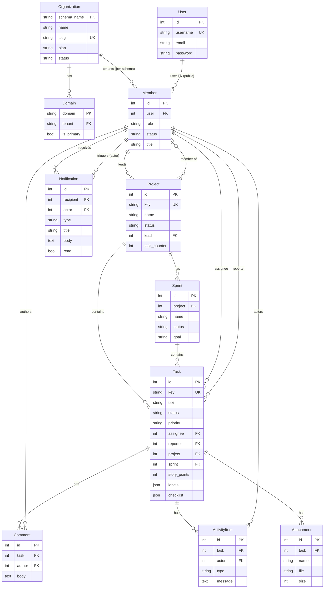

# Database Documentation

This document describes the TaskFlow database schema, relationships, constraints, multi-tenant isolation strategy, and migration workflow.

---

## 1. Database Engine

TaskFlow uses **PostgreSQL 17** with the django-tenants schema-per-tenant extension.

```python
# Backend/taskforge_backend/settings.py
DATABASES = {
    'default': {
        'ENGINE': 'django_tenants.postgresql_backend',
        'NAME': config('DB_NAME', default='taskforge_db'),
        'USER': config('DB_USER', default='postgres'),
        'PASSWORD': config('DB_PASSWORD', default='password'),
        'HOST': config('DB_HOST', default='localhost'),
        'PORT': config('DB_PORT', default='5433'),
        'CONN_MAX_AGE': 600,  # Connection pooling (10 minutes)
        'OPTIONS': {'connect_timeout': 10},
    }
}
```

The `django_tenants.postgresql_backend` engine extends the standard PostgreSQL backend to support schema-based search path switching.

---

## 2. Multi-Tenant Schema Architecture

TaskFlow uses the **schema-per-tenant** strategy. A single PostgreSQL database (`taskforge_db`) contains multiple schemas:

| Schema | Contents | Purpose |
|--------|----------|---------|
| `public` | `Organization`, `Domain`, `User`, token blacklist | Shared/global data |
| `demo` | `Member`, `Project`, `Task`, `Sprint`, `Notification`, etc. | Tenant-specific data for "demo" org |
| `{slug}` | Same tenant tables | One schema per organization |

### App classification

```python
SHARED_APPS = [
    'django_tenants', 'organizations', 'corsheaders', 'health',
    'django.contrib.contenttypes', 'django.contrib.auth',
    'django.contrib.sessions', 'django.contrib.messages',
    'django_ratelimit', 'django.contrib.staticfiles',
    'rest_framework_simplejwt.token_blacklist',
]

TENANT_APPS = [
    'django.contrib.contenttypes', 'core', 'tasks', 'sprints',
    'notifications', 'rest_framework', 'rest_framework_simplejwt',
]
```

The `TenantSyncRouter` ensures shared apps' tables are created in the `public` schema, while tenant apps' tables are created in each tenant schema during `migrate_schemas`.

### Why token_blacklist is in SHARED_APPS

`rest_framework_simplejwt.token_blacklist` references `AUTH_USER_MODEL`, which lives in the public schema. Login and token refresh always occur against the public schema. Placing the blacklist tables in tenant schemas caused `"relation token_blacklist_outstandingtoken does not exist"` errors.

---

## 3. Entity-Relationship Diagram



---

## 4. Schema Details

### `public` Schema

#### `organizations_organization` (Tenant Model)

| Column | Type | Constraints | Notes |
|--------|------|------------|-------|
| `id` | BigAutoField | PK | |
| `schema_name` | CharField(63) | Unique | PostgreSQL schema name |
| `name` | CharField(100) | | Organization display name |
| `slug` | SlugField | Unique | URL-safe identifier |
| `plan` | CharField(50) | Default `free` | Billing plan |
| `status` | CharField(20) | Default `active` | |
| `created_at` | DateTimeField | Auto | |
| `updated_at` | DateTimeField | Auto | |

#### `organizations_domain`

| Column | Type | Constraints | Notes |
|--------|------|------------|-------|
| `id` | BigAutoField | PK | |
| `domain` | CharField(253) | Unique | e.g., `demo.localhost` |
| `tenant` | ForeignKey→Organization | | Owning tenant |
| `is_primary` | BooleanField | | Primary domain flag |

#### `auth_user` (Django default User)

Standard Django User model. Used globally across all tenants.

#### `token_blacklist_*` (SimpleJWT)

Tables for outstanding and blacklisted JWT refresh tokens.

---

### Tenant Schemas (per organization)

#### `core_member`

| Column | Type | Constraints | Notes |
|--------|------|------------|-------|
| `id` | BigAutoField | PK | |
| `user` | ForeignKey→User | Unique | One member per user per tenant |
| `role` | CharField(20) | Choices: admin, manager, member, viewer | Default `member` |
| `status` | CharField(20) | Choices: active, invited, suspended | Default `active` |
| `title` | CharField(100) | Nullable | Job title |
| `created_at` | DateTimeField | Auto | |
| `updated_at` | DateTimeField | Auto | |

> **Constraint:** `user` has `unique=True`, enforcing one membership per user per tenant schema.

#### `core_project`

| Column | Type | Constraints | Notes |
|--------|------|------------|-------|
| `id` | BigAutoField | PK | |
| `key` | CharField(10) | Unique | e.g., `TF`, `PROJ` |
| `name` | CharField(100) | | |
| `description` | TextField | Nullable | |
| `status` | CharField(20) | Choices: planning, active, on_hold, completed | Default `planning` |
| `start_date` | DateField | Nullable | |
| `due_date` | DateField | Nullable | |
| `lead` | ForeignKey→Member | SET_NULL, Nullable | Project lead |
| `color` | CharField(20) | Default `#6366f1` | |
| `task_counter` | IntegerField | Default 0 | Atomic counter for task keys |
| `created_at` | DateTimeField | Auto | |
| `updated_at` | DateTimeField | Auto | |

**Through table:** `core_project_members` (M2M between Project and Member).

#### `tasks_task`

| Column | Type | Constraints | Notes |
|--------|------|------------|-------|
| `id` | BigAutoField | PK | |
| `key` | CharField(20) | Unique | Auto-generated: `{project.key}-{counter}` |
| `title` | CharField(200) | | |
| `description` | TextField | Nullable | |
| `status` | CharField(20) | Choices: backlog, todo, in_progress, review, done | Default `backlog` |
| `priority` | CharField(20) | Choices: low, medium, high, urgent | Default `medium` |
| `assignee` | ForeignKey→Member | SET_NULL, Nullable | |
| `reporter` | ForeignKey→Member | CASCADE | Required |
| `project` | ForeignKey→Project | CASCADE | Required |
| `sprint` | ForeignKey→Sprint | SET_NULL, Nullable | |
| `story_points` | IntegerField | Default 0 | |
| `due_date` | DateField | Nullable | |
| `labels` | JSONField | Default `[]` | List of strings (validated in `clean()`) |
| `checklist` | JSONField | Default `[]` | List of `{name, done}` objects (validated in `clean()`) |
| `created_at` | DateTimeField | Auto | |
| `updated_at` | DateTimeField | Auto | |

#### `sprints_sprint`

| Column | Type | Constraints | Notes |
|--------|------|------------|-------|
| `id` | BigAutoField | PK | |
| `project` | ForeignKey→Project | CASCADE | Required |
| `name` | CharField(100) | | |
| `goal` | TextField | Nullable | |
| `status` | CharField(20) | Choices: planned, active, completed | Default `planned` |
| `start_date` | DateField | Nullable | |
| `end_date` | DateField | Nullable | |
| `created_at` | DateTimeField | Auto | |
| `updated_at` | DateTimeField | Auto | |

**Computed (cached, not stored):** `total_points`, `completed_points` (Redis-cached aggregations).

#### `tasks_comment`

| Column | Type | Constraints | Notes |
|--------|------|------------|-------|
| `id` | BigAutoField | PK | |
| `task` | ForeignKey→Task | CASCADE | |
| `author` | ForeignKey→Member | CASCADE | |
| `body` | TextField | | |
| `created_at` | DateTimeField | Auto | |
| `updated_at` | DateTimeField | Auto | |

#### `tasks_activityitem`

| Column | Type | Constraints | Notes |
|--------|------|------------|-------|
| `id` | BigAutoField | PK | |
| `task` | ForeignKey→Task | CASCADE | |
| `actor` | ForeignKey→Member | CASCADE | |
| `type` | CharField(20) | Choices: created, updated, commented, assigned, status_changed, sprint_changed | |
| `message` | TextField | | Human-readable description |
| `created_at` | DateTimeField | Auto | |

#### `tasks_attachment`

| Column | Type | Constraints | Notes |
|--------|------|------------|-------|
| `id` | BigAutoField | PK | |
| `task` | ForeignKey→Task | CASCADE | |
| `name` | CharField(255) | | Original filename |
| `file` | FileField | Nullable | Stored in `attachments/` |
| `size` | IntegerField | Default 0 | Bytes |
| `created_at` | DateTimeField | Auto | |

#### `notifications_notification`

| Column | Type | Constraints | Notes |
|--------|------|------------|-------|
| `id` | BigAutoField | PK | |
| `recipient` | ForeignKey→Member | CASCADE | Notification owner |
| `type` | CharField(20) | Choices: mention, assignment, project, sprint, comment | |
| `title` | CharField(200) | | |
| `body` | TextField | Blank | |
| `read` | BooleanField | Default False | |
| `actor` | ForeignKey→Member | SET_NULL, Nullable | Who triggered it |
| `related_task_id` | PositiveIntegerField | Nullable | Denormalized task reference |
| `related_project_id` | PositiveIntegerField | Nullable | Denormalized project reference |
| `created_at` | DateTimeField | Auto | |
| `updated_at` | DateTimeField | Auto | |

**Ordering:** `Meta.ordering = ['-created_at']` (newest first).

---

## 5. Key Constraints & Invariants

| Constraint | Enforcement | Location |
|-----------|-------------|----------|
| Unique project keys | `unique=True` on `Project.key` | DB-level |
| Unique task keys | `unique=True` on `Task.key` | DB-level |
| One membership per user per tenant | `unique=True` on `Member.user` | DB-level |
| Unique organization slugs | `unique=True` on `Organization.slug` | DB-level |
| Unique domains | `unique=True` on `Domain.domain` | DB-level |
| Atomic task counter | `F('task_counter')` increment in `Task.save()` | App-level (race-safe) |
| Labels must be list of strings | `Task.clean()` validation | App-level |
| Checklist structure | `Task.clean()` validation (objects with `name`+`done`, `done` must be bool) | App-level |
| One active sprint per project | `SprintViewSet.start()` checks for existing active sprint | App-level |
| Only active members can access data | `IsTenantMember` permission | App-level |

---

## 6. Application-Level Validation

The `Task.clean()` method enforces JSON structure validation that the database cannot:

```python
def clean(self):
    super().clean()
    if self.labels and not isinstance(self.labels, list):
        raise ValidationError({'labels': 'Must be a list of strings.'})
    if self.labels:
        for label in self.labels:
            if not isinstance(label, str):
                raise ValidationError({'labels': 'Each label must be a string.'})
    if self.checklist and not isinstance(self.checklist, list):
        raise ValidationError({'checklist': 'Must be a list of objects with "name" and "done" keys.'})
    if self.checklist:
        for item in self.checklist:
            if not isinstance(item, dict):
                raise ValidationError({'checklist': 'Each checklist item must be an object.'})
            if 'name' not in item or 'done' not in item:
                raise ValidationError({'checklist': 'Each item must have "name" and "done" keys.'})
            if not isinstance(item['done'], bool):
                raise ValidationError({'checklist': '"done" must be a boolean.'})
```

---

## 7. Migration Strategy

### Creating migrations

```bash
cd Backend
python manage.py makemigrations
```

### Applying migrations

django-tenants requires special migration commands:

```bash
# Migrate shared (public) apps
python manage.py migrate_schemas --shared

# Migrate all tenant schemas
python manage.py migrate_schemas

# In production via Docker
docker compose exec backend python manage.py migrate_schemas
```

### Migration files

| App | Migrations |
|-----|-----------|
| `organizations` | `0001_initial` (Organization, Domain) |
| `core` | `0001_initial`, `0002_alter_member_unique_together_alter_member_user`, `0003_project_task_counter` |
| `tasks` | `0001_initial` (Task, Comment, ActivityItem, Attachment) |
| `sprints` | `0001_initial` (Sprint) |
| `notifications` | `0001_initial` (Notification) |

### Creating a new tenant schema programmatically

When a new organization is onboarded, django-tenants automatically creates and migrates the schema (because `Organization.auto_create_schema = True`). The schema name is derived from the slug with hyphens replaced by underscores:

```python
# organizations/serializers.py
tenant = Organization.objects.create(
    name=org_name,
    slug=org_slug,
    schema_name=org_slug.replace('-', '_'),
    plan='Enterprise'
)
```

---

## 8. Seeding Demo Data

The `bootstrap_public.py` script creates a demo tenant with seed data:

```bash
python bootstrap_public.py
```

This creates:
1. **Public tenant** (`localhost` domain)
2. **Three global users**: `admin`, `john`, `alice` (password: `password` for all)
3. **Demo tenant** (`demo.localhost` domain, `demo` schema)
4. **Members**, a **project** (`TF`), a **sprint**, and **sample tasks** with comments

### Demo credentials

| Username | Email | Password | Role |
|----------|-------|----------|------|
| `admin` | admin@taskflow.com | `password` | admin |
| `john` | john@taskflow.com | `password` | member |
| `alice` | alice@taskflow.com | `password` | manager |

---

## 9. Backup & Restore

### Backup

```bash
# Full database backup
docker compose exec db pg_dump -U postgres taskforge_db > backup.sql

# Backup a specific tenant schema
docker compose exec db pg_dump -U postgres -n demo taskforge_db > demo_tenant.sql
```

### Restore

```bash
docker compose exec -T db psql -U postgres taskforge_db < backup.sql
```

---

## 10. Indexes

Django automatically creates indexes on:
- All primary keys (`id`)
- All unique fields (`key`, `slug`, `domain`, `user` on Member)
- All foreign keys (`project_id`, `task_id`, `assignee_id`, etc.)

The full-text search view creates a weighted `SearchVector` at query time (not a materialized index). For production scale, consider adding a PostgreSQL `GIN` index on the search vector.
